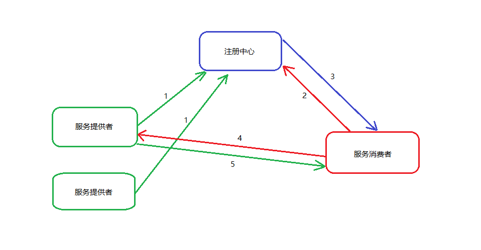

### 基础知识

#### 一、框架基本调用流程

1. 服务提供者向服务注册中心注册对外暴露的服务信息，服务信息包括接口名，分组，版本号等。框架默认使用`zookeeper`注册中心，
存储节点以临时顺序节点实现，当服务提供者挂掉或与注册中心断开连接时，临时节点会被zookeeper删除，
以保障服务注册信息的可用与实时性。
2. 服务消费者启动时会连接注册中心，将所有的远程服务地址缓存到本地，并监听注册中心，获取实时的数据。
3. 一旦有新的服务提供者加入到集群或者退出集群，注册中心就会通知服务消费者，服务消费者接到通知后，会拉取最新的服务数据，更新本地缓存。
4. 一旦发生远程调用，服务消费者会根据接口，分组，版本号去缓存中匹配可用的服务提供者地址，并通过负载均衡策略，选择其中一个进行远程调用。
5. 服务提供者执行完远程调用后将结果或者异常返回给服务消费者。

#### 二、框架所包含的子系统
* `SerializeManager`:序列化子系统
* `RegistryManager`:服务注册子系统
* `BalanceManager`:负载均衡子系统
* `ProviderManager`:服务提供子系统
* `ConsumerManager`:服务消费子系统

#### 三、在`非Spring`应用中使用
该框架在设计模式上采用了`Facade`外观模式，`FastcallManager`的默认实现类`DefaultFastcallManager`是系统的外观，封装了所有子系统的功能，对外提供统一的接口。
在`非Spring`应用中使用时，我们只需要通过`FastcallManager`的工厂类，生成`DefaultFastcallManager`单例对象，就可以通过该对象，调用框架的所有功能。

##### 1. 添加依赖
```
<dependency>
    <groupId>net.stackoverflow.fastcall</groupId>
    <artifactId>fastcall-core</artifactId>
    <version>${fastcall.version}</version>
</dependency>
```

##### 2. 生成外观对象
```
//实例化配置类（亦可通过FastcallConfigBuilder建造者，一步一步生成配置类）
FastcallConfig config = new FastcallConfig();
//修改默认配置（此处启用了服务提供子系统）
config.getProvider().setEnabled(true);

//生成工厂类，并由工厂类生成DefaultFastcallManager的单例对象
FastcallManagerFactory factory = new ConfigFastcallManagerFactory(config);
FastcallManager manager = factory.getInstance();

//接下来可以使用FastcallManager对象，调用框架提供的功能
```

#### 四、在`Spring`应用中使用，以`Spring boot`为例
该框架提供了`fastcall-spring-boot-autoconfigure`和`fastcall-spring-boot-starter`两个模块，以便对`Spring boot`应用进行支持。在`Spring boot`应用中添加框架
的`starter`后，只需要少量的配置就可以使用该框架，完美体现了`Spring boot`的**约定优于配置**的理念。

##### 1. 添加依赖
```
<dependency>
    <groupId>net.stackoverflow.fastcall</groupId>
    <artifactId>fastcall-spring-boot-starter</artifactId>
    <version>${fastcall.version}</version>
</dependency>
```

##### 2. 必要的配置
```
#启用服务提供子系统（只使用服务消费功能可以不加）
fastcall.provider.enabled=true
#配置服务注册中心的地址
fastcall.registry.zookeeper.host=127.0.0.1
fastcall.registry.zookeeper.port=2181
```

##### 3. 在启动类上添加注解（只使用服务消费功能可以不加此注解，此注解的功能类似于`@ComponentScan`，`basePackages`属性标识了注解扫描的包路径）
```
@EnableFastcall(basePackages = {"net.stackoverflow.fastcall.demo.provider"})
```